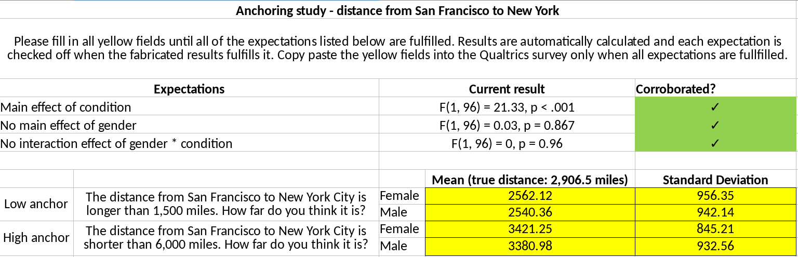

# Abstract

PLACEHOLDER

## Keywords

PLACEHOLDER

```{r preparation, echo = FALSE}
suppressPackageStartupMessages(if(!require(pROC)){install.packages('pROC', repos = 'http://cran.us.r-project.org')})
suppressPackageStartupMessages(library(pROC))
suppressPackageStartupMessages(if(!require(knitr)){install.packages('knitr', repos = 'http://cran.us.r-project.org')})
suppressPackageStartupMessages(library(knitr))
suppressPackageStartupMessages(if(!require(foreign)){install.packages('foreign', repos = 'http://cran.us.r-project.org')})
suppressPackageStartupMessages(library(foreign))
suppressPackageStartupMessages(if(!require(latex2exp)){install.packages('latex2exp', repos = 'http://cran.us.r-project.org')})
suppressPackageStartupMessages(library(latex2exp))
suppressPackageStartupMessages(if(!require(ggplot2)){install.packages('ggplot2', repos = 'http://cran.us.r-project.org')})
suppressPackageStartupMessages(library(ggplot2))
suppressPackageStartupMessages(if(!require(gridExtra)){install.packages('gridExtra', repos = 'http://cran.us.r-project.org')})
suppressPackageStartupMessages(library(gridExtra))
suppressPackageStartupMessages(if(!require(xtable)){install.packages('xtable', repos = 'http://cran.us.r-project.org')})
suppressPackageStartupMessages(library(xtable))
suppressPackageStartupMessages(if(!require(httr)){install.packages('httr', repos = 'http://cran.us.r-project.org')})
suppressPackageStartupMessages(library(httr))
suppressPackageStartupMessages(if (!require(car)){install.packages('car', repos = 'http://cran.us.r-project.org')})
suppressPackageStartupMessages(library(car))
suppressPackageStartupMessages(if (!require(lsr)){install.packages('lsr', repos = 'http://cran.us.r-project.org')})
suppressPackageStartupMessages(library(lsr))
suppressPackageStartupMessages(if (!require(data.table)){install.packages('data.table', repos = 'http://cran.us.r-project.org')})
suppressPackageStartupMessages(library(data.table))
suppressPackageStartupMessages(if (!require(dplyr)){install.packages('dplyr', repos = 'http://cran.us.r-project.org')})
suppressPackageStartupMessages(library(dplyr))
suppressPackageStartupMessages(if (!require(reshape2)){install.packages('reshape2', repos = 'http://cran.us.r-project.org')})
suppressPackageStartupMessages(library(reshape2))
suppressPackageStartupMessages(if (!require(metafor)){install.packages('metafor', repos = 'http://cran.us.r-project.org')})
suppressPackageStartupMessages(library(metafor))

# Add ../ before running rmarkdown, or vice versa when not running there
x12 <- '../'
# x12 <- ''

source(sprintf('%sfunctions/digit_analysis.R', x12))
source(sprintf('%sfunctions/std_var.R', x12))
source(sprintf('%sfunctions/fisher_method.R', x12))

ml_file <- sprintf('%sdata/study_01/ml_summary_stats.csv', x12)
qualtrics_file <- sprintf('%sdata/study_01/qualtrics_processed.csv', x12)
dat_summary_file <- sprintf('%sdata/study_01/study1_res.csv', x12)
file <- sprintf('%sdata/study_01/raw_summary_results_fabrication_qualtrics.csv', x12)
res_file <- sprintf('%sdata/study_01/qualtrics_processed.csv', x12)
ml_dat_file <- sprintf('%sdata/study_01/anchoring_ml/chjh ml1_anchoring cleaned.sav', x12)
summary_stat_file <- sprintf('%sdata/study_01/ml_summary_stats.csv', x12)
ml3_dat_file <- sprintf('%sdata/study_02/study_02-ml3_stroop/StroopCleanSet.csv', x12)
pdf_file <- sprintf('%sarchive/gender_interaction.pdf', x12)

# Set the number of iterations to use in calculations
iter <- 100000

tabnr <- 1
fignr <- 1
```

# Introduction

Any field of empirical inquiry is faced with cases of scientific misconduct at some point, either in the form of fabrication, falsification or plagiarism (FFP). Psychology was faced with Stapel; medical sciences were faced with Poldermans and Macchiarini; life sciences were faced with Voignet. These are just a few examples of misconduct cases in the last decade. Overall, an estimated 2\% of all scholars have admitted to falsifying or fabricating research results at least once [@10.1371/journal.pone.0005738], which is likely to be an underestimate due to socially desirable responses. The detection rate of data fabrication is likely to be even lower; for example, only around a dozen cases become public in the United States and the Netherlands, despite covering several hundreds of thousands of researchers. At best, this suggests a detection rate far below 1\% of those 2\% who admit to fabricating data --- the tip of a seemingly much larger iceberg.

In order to stifle attempts at data fabrication, improved detection of fabricated data is considered to deter such harmful attempts. 
This idea is based on deterrence theory [@leviathan], which stipulates that with increased risk of detection, the utility of scientific misconduct will decrease and therefore fewer people will engage in such behaviors. Implementation of deterrence has not occurred equally across fabrication, falsification, and plagiarism. For plagiarism, it has been implemented with plagiarism scanners, a development that already started a long time ago [e.g., @10.1109/13.28038]. For data fabrication, detecting image manipulation has increasingly become possible and implemented. The Journal of Cell Biology and the EMBO journal scan each submitted image for potential manipulation [@The_Journal_of_Cell_Biology2015-vh;@10.1038/546575a], which greatly increases the risk of detecting (blatant) image manipulation. More recently, algorithms have been developed to automate the scanning of images for (subtle) manipulations [@10.1007/s11948-016-9841-7]. These developments in detecting image manipulation have increased detection risk during the pre-publication and post-publication phase and increase the understanding of how images might be manipulated. Moreover, their application also helps researchers systematically evaluate research articles to estimate the extent of the problem of image manipulation [4\% of all papers are estimated to contain manipulated images, @10.1128/mBio.00809-16]. 

Statistical methods provide one way to improve detection of data fabrication in empirical research. Humans are notoriously bad at understanding and estimating randomness [@10.1126/science.185.4157.1124;@10.1037/h0031322;@10.1037/1082-989X.5.2.241], which could manifest itself in the fundamentally probabilistic data they try to fabricate. 
When data are fabricated, principles of statistics and randomness are easily violated at the univariate level, bivariate level, trivatiate level, or beyond [@Haldane1948-nm]. Based on this idea, statistical methods that investigate whether the reported data are feasible under the theoretically probabilistic processes can be used to detect potential data fabrication.

```{r echo=FALSE}
m <- 50
sd <- 10
n <- 100

set.seed(1234)
x1_1 <- replicate(n = 10, expr = rnorm(n, m, sd))
x1_2 <- replicate(n = 10, expr = rnorm(n, m, sd))

ex1_1em <- apply(x1_1, 2, mean)
ex1_1esd <- apply(x1_1, 2, sd)
ex1_1cm <- apply(x1_2, 2, mean)
ex1_1csd <- apply(x1_2, 2, sd)
ex1_1tp <- NULL
for (i in 1:dim(x1_1)[2]) ex1_1tp[i] <- t.test(x = x1_1[,i], y = x1_2[,i], var.equal=TRUE)$p.value
ex1_1tp <- unlist(ex1_1tp)

set.seed(1234)
x2_1em <- replicate(n = 10, expr = m + runif(1, 0, 20))
x2_2cm <- replicate(n = 10, expr = m + runif(1, 0, 20))
x2_1esd <- replicate(n = 10, expr = sd + runif(1, 0, 1.5))
x2_2csd <- replicate(n = 10, expr = sd + runif(1, 0, 1.5))

sdpooled <- ((n - 1) * x2_1esd^2 + (n - 1) * x2_2csd^2)/(n * 2 - 2)
tval <- (x2_1em - x2_2cm) / sdpooled
ex2_1tp <- pt(abs(tval), n * 2 - 2, lower.tail = FALSE) * 2

# Just saving for later use in theory section
# set.seed(1234)
# std_var(n = rep(100, length(x2_1esd) * 2), sds = c(x2_1esd, x2_2csd), iter = 10000)

df <- data.frame(study = sprintf("Study %s", 1:10),
         sprintf("%s (%s)", round(ex1_1em, 3), round(ex1_1esd, 3)),
         sprintf("%s (%s)", round(ex1_1cm, 3), round(ex1_1csd, 3)),
         ex1_1tp,
         sprintf("%s (%s)", round(x2_1em, 3), round(x2_1esd, 3)),
         sprintf("%s (%s)", round(x2_2cm, 3), round(x2_2csd, 3)),
         ex2_1tp)
names(df) <- c("Study",
        "$M_E$ ($SD_E$) [S1]",
        "$M_C$ ($SD_C$) [S1]",
        "P-value [S1]",
        "$M_E$ ($SD_E$) [S2]",
        "$M_C$ ($SD_C$) [S2]",
        "P-value [S2]")
```

Statistical methods to detect data fabrication have been applied in several cases of scientific misconduct in recent years and has potential for future application beyond these specific cases. 
For example, excessive consistency in papers by Fuji were highlighted with statistical methods [@10.1111/j.1365-2044.2012.07128.x;@10.1111/anae.13126], resulting in 183 retractions [@oransky2015]. Carlisle's method works as follows: in true randomized clinical trials (RCTs) baseline measurements should be identically distributed across groups. As such, the $p$-values for group comparisons would be expected to be uniformly distributed because the null hypothesis of identical distributions across groups is true by definition of the randomized design. In the Fuji papers, group comparisons showed excessive consistency, resulting primarily in high $p$-values (e.g., .99, .95) and a high mean $p$-value across the comparisons, where a mean $p$-value of .5 is expected. As an illustration, see Table `r tabnr`, which depicts 10 hypothetical studies containing 100 participants per condition, for true randomized designs (Set 1) or for fabricated designs (Set 2). The mean $p$-value for the true randomized design Set 1 is `r round(mean(ex1_1tp), 3)`, whereas the fabricated Set 2 has mean $p$-value `r round(mean(ex2_1tp), 3)`. Other statistical methods to detect data fabrication are addressed in the theoretical sections.
.

```{r table_excess, echo = FALSE}
knitr::kable(df, digits = 3, caption = "Examples of means and standard deviations for a continuous outcome in genuine- and fabricated randomized clinical trials. Set 1 (S1) is randomly generated data under the null hypothesis of random assignment (assumed to be the genuine process), whereas Set 2 (S2) is generated under excessive consistency with equal groups. Each trial condition contains 100 participants. The $p$-values are the result of independent $t$-tests comparing the experimental and control conditions within each respective set.")
```

Statistical methods to detect data fabrication, although developed to quantify suspicions in a specific paper, could be applied to screen multiple papers. The application of such methods can be (semi-)automated if data are available in a machine-readable format that one of the statistical methods can be applied to. An example of such a potential case for mass application of using statistics to detect (potential) data fabrication is in the ClinicalTrials.gov database, where baseline measures across randomized groups are readily available for download and subsequent analysis [@10.3897/rio.1.e7462]. 

Nonetheless, prior to applying statistical methods to flag potentially fabricated results, investigating whether such methods perform well enough in detecting data fabrication is required for responsible application. 
We hardly know how researchers might go about fabricating data. Cases such as Stapel, Fuji, Smeesters, and Sanna provide some insights, but are highly pre-selected (i.e., those who got caught/confessed) and as such, may be systematically biased. Relatively extensive descriptions in rare and partial autobiogrophical accounts provide little insight into the actual data fabrication process, except for the setting where it might take place [e.g., late at night when no one is around; @stapel_book]. Additionally, the performance of methods to detect data fabrication is highly dependent on the unknown prevalence of data fabrication and the power to actually detect data fabrication. Given that we do not know how researchers might fabricate data, the diagnosticity of these methods cannot realistically be assessed.

Throughout this paper, we inspect statistical methods to detect potential data fabrication that can be applied to summary statistics (Study 1) or raw data (Study 2). 
Even though structure and contents of data can look different depending on the structure of a study and the measures, there are certain common characteristics of empirical results and the underlying raw data that can be inspected. For example, summary statistics frequently include means, standard deviations, test-statistics, and $p$-values. Raw data frequently contain at least some variables measured at a interval- or ratio scale [@10.1126/science.103.2684.677]. Such common characteristics allow for the development of generic statistical methods that can be applied across a varied set of results to screen for fabricated data. For each study, we review the theory of the specific methods we apply. However, the reviewed methods are not exhaustive of all methods available to test for potential data fabrication in empirical data [see also, @buyse1999;@10.7287/peerj.preprints.2400v1;@10.7287/peerj.preprints.2064v1;@sprite-heathers].

# Theoretical framework

In the current paper, we differentiate between statistical methods to detect potential data fabrication based on reported summary statistics or raw data. For summary statistics, we review $p$-value analysis, variance analysis, and effect size analysis as potential ways to detect data fabrication. $P$-value analysis can be applied whenever sufficient nonsignificant $p$-values are reported; variance analysis can be applied whenever a set of variances are reported for independent groups alongside the sample sizes per group; effect size analysis can be used whenever the effect size is reported or can be computed [e.g., an APA reported t- or F-statistic;@10.1525/collabra.71]. For raw data, we review digit analyses (i.e., the Newcomb-Benford law and terminal digit analysis) and multivariate associations as potential ways to detect data fabrication. Both types of digit analyses can be applied when ratio scale measures are present in the raw data and only terminal digit analysis can be applied when there are continuous measures. Multivariate associations can be investigated whenever there are two or more variables and data on that same relation is available from (assumably) genuine data sources.

## Detecting data fabrication in summary statistics

### P-value analysis

The distribution of a $p$-value is uniform if the null hypothesis is true and right-skewed if the alternative hypothesis is true [@fisher1925]. The distribution of one $p$-value is the result of the population effect size, the precision of the estimate, and the observed effect size, whose properties carry over to a set of independent $p$-values if those $p$-values are independent. As such, the $p$-value distribution of a set of $p$-values is uniform when the null hypothesis is true, or right-skewed when the alternative hypothesis is true.

When a $p$-value distribution of independent $p$-values is not uniform or right-skewed, as would be theoretically expected, it can indicate potential data fabrication. For example, in the Fuji case, supposedly identically distributed groups were fabricated. However, this resulted in excessively large $p$-values and ultimately the identification of potential data fabrication by @10.1111/j.1365-2044.2012.07128.x. Our illustration in Table `r tabnr` also shows the difference between expected data under the null distribution (Set 1) and what might result from excessively consistent and fabricated data (Set 2). More specifically, the expected value of a uniform $p$-value distribution is .5, but the fabricated data from our illustration result in a mean $p$-value of `r round(mean(ex2_1tp), 3)`.

In order to test whether the distribution of nonsignificant and independent $p$-values might be fabricated, we proposed an adaptation of Fisher's method [@10.1186/s41073-016-0012-9]. This adaptation is a reversal of the original Fisher method [@fisher1925], which was introduced as a meta-analytic test for the presence of an effect. This test is computed as 
$$F
\chi^2_{2k}=-2\sum\limits^k_{i=1}\ln(p_i)
$$
where it tests for more smaller $p$-values than larger $p$-values across the $k$ number of $p$-values. Reversing the original Fisher method, which tests for right-skew, into a Fisher method that tests for left-skew results in 
$$
\chi^2_{2k}=-2\sum\limits^k_{i=1}\ln(1-\frac{p_i-t}{1-t})
$$
where it now tests for more larger $p$-values than smaller $p$-values across the $k$ number of $p$-values that fall above the threshold $t$. When the threshold is set to zero, it selects all $p$-values, but when this $t>0$ the remaining $p$-values are rescaled to fit the original 0-1 range (i.e., by dividing by $1-t$). Upon writing this paper, it became clear to us that this reversed Fisher method is similar to the operating principle of Carlisle's method testing for excessive homogeneity across baseline measurements in RCTs [@10.1111/anae.13938;@10.1111/j.1365-2044.2012.07128.x;@10.1111/anae.13126], which we had not realized before.

```{r, echo = FALSE}
threshold <- .05
genuine_p <- ex1_1tp[ex1_1tp > threshold]
fab_p <- ex2_1tp[ex2_1tp > threshold]
genuine_chi <- -2 * sum(log(1 - ((genuine_p - threshold) / (1 - threshold))))
fab_chi <- -2 * sum(log(1 - ((fab_p - threshold) / (1 - threshold))))
genuine_chi_p <- pchisq(q = genuine_chi, df = 2 * length(genuine_p), lower.tail = FALSE)
fab_chi_p <- pchisq(q = fab_chi, df = 2 * length(fab_p), lower.tail = FALSE)
x <- c(.21, -.08, -.37, -.08, .32)
pval <- pnorm(abs(x), 0, 1, lower.tail = FALSE) * 2
pval <- pval[pval > threshold]
chi <- -2 * sum(log(1 - ((pval - threshold) / (1 - threshold))))
p_chi <- pchisq(q = chi, df = 2 * length(pval), lower.tail = FALSE)
```

As an example, we apply the reversed Fisher method to both the genuine- and fabricated results from our illustration in Table `r tabnr` and data from the Fuji case. Using the threshold $t=`r threshold`$ to only select the nonsignificant results, we retain $k=`r length(genuine_p)`$ genuine $p$-values and $k=`r length(fab_p)`$ fabricated $p$-values. Calculating the $\chi^2$ value for sets of $k$ nonsigificant $p$-values results in a $\chi^2=`r round(genuine_chi, 3)`$ for the $p$-values resulting from the genuine data and $\chi^2=`r round(fab_chi, 3)`$ for the $p$-values resulting from the fabricated data, with $p$-values `r round(genuine_chi_p, 3)` and `r round(fab_chi_p, 3)` respectively, using $2k$ as the degrees of freedom of the $\chi^2$-test. Another example, directly from the Fuji case [@10.1111/j.1365-2044.2012.07128.x], anecdotally illustrates that fabricated data can result in significant findings with the reversed Fisher method. $p$-values from five independent comparisons for one dependent measure [fentanyl dose, as extracted from Table 3 in @10.1111/j.1365-2044.2012.07128.x] show excessively high $p$-values, $\chi^2_{`r length(pval) * 2`}=`r round(chi, 3)`, p=`r round(p_chi, 3)`$.

Despite this test being useful for detecting data fabrication in nonsignificant $p$-values, one exception should be taken into account: wrongly specified one-tailed tests. For properly specified one-tailed tests, the $p$-value distribution is right-skewed. When wrongly specified, this distribution is reversed and becomes left-skew. As such, any data fabrication detected with this method would need to be inspected for misspecified one-tailed hypotheses to preclude false conclusions.

### Variance analysis

Variance- or standard deviation estimates are typically reported to indicate dispersion, but just like the mean there should be sampling error in this estimate proportional to the sample size [i.e., $\sigma/\sqrt{2n}$ under the assumption of normality, p. 351,@yule1922]. If an observed random variable $x$ is normally distributed, the variance of $x$ is $\chi^2$-distributed [p. 445; @hogg-tanis]; that is
$$
var(x)\sim\frac{\chi^2_{N_j-1}}{N_j-1}
$$
where $N$ is the sample size of the $j$th group. Using the reported summary statistics, we can compute the Mean Squares within ($MS_w$) each condition as
$$
MS_w=\frac{\sum\limits^k_{j=1}(N_j-1)s^2_j}{\sum\limits^k_{j=1}(N_j-1)}
$$
where $s^2_j$ is the variance in the $j$th group. The reported variances can be standardized by dividing the observed variances by the $MS_w$; we denote standardized variances with z^2$.

Standardizing the reported variances allows for several measures of observed dispersion to be calculated. Observed dispersion of the standardized variances can be operationalized as the standard deviation of the variances [denoted in this paper as $SD_z$, @10.1177/0956797613480366] or as the range of the variances (denoted as $max-min_z$). Note that such comparisons are only meaningful if the reported variances originate from a homogeneous population distribution of variances (otherwise, subgroups need to be made). 

In order to compute the expected dispersion, we use the distribution of the standardized variances to compute how extreme the observed dispersion of the variances is. Assuming normality, the distribution of the standardized variances follows a $\chi^2$-distribution in the form of
$$
z^2_j\sim\left(\frac{\chi^2_{N_j-1}}{N_j-1}\right)/MS_w
$$
which is the result of the distribution of $var(x)$ as denoted earlier, divided by the $MS_w$. From this distribution, fictitious variances can be generated for each group under investigation that are subsequently used to compute one of the measures for dispersion proposed in the previous paragraph (e.g., standard deviation of the variances). Repeating this across $i$ iterations provides an estimate of the density function for the expection dispersion of the variances, to which the observed dispersion of the variances can be compared. For our purposes, too little dispersion in the variances indicates potential fabrication in the reported data [@10.1177/0956797613480366].

```{r, echo = FALSE}
sd1 <- c(ex1_1esd, ex1_1csd)
sd2 <- c(x2_1esd, x2_2csd)

iterate <- 10000
res1 <- std_var(n = rep(100, length(sd1)), sds = sd1, iter = iterate)
res2 <- std_var(n = rep(100, length(sd2)), sds = sd2, iter = iterate)
```

As an example, we apply the variance analysis to the illustration from Table `r tabnr` and the Smeesters case. For the reported standard deviations in Table `r tabnr`, we apply the variance analysis across those in the genuine- and fabricated sets separately. For the genuine data (Set 1), we find that the reported mean standard deviation is `r mean(sd1)` with a standard deviation of `r sd(sd1)`; for the fabricated data (Set 2), we find that the reported mean standard deviation is `r mean(sd2)` with a standard deviation of `r sd(sd2)`. These summary statistics of the summary statistics already indicate there is a difference between the genuine- and fabricated data, which the variance analyses confirm: Set 1 has no excessive consistency (`r round(res1, 3)`), whereas Set 2 does show excessive consistency (`r round(res2, 3)`). In words, out of `r iterate` fictitious samples, `r res1 * iterate` showed more consistency for Set 1, whereas only `r res2 * iterate` showed more consistency for Set 2. In the Smeesters case three independent conditions from the same study ($n_k=15$) were reported to have standard deviations 25.09, 24.58, and 25.65. The standard deviation of the standard deviations here is `r round(sd(c(25.09, 24.58, 25.65)), 2)` (i.e., $SD_z$). Such consistency (or more consistency) would only be observed in `r round(std_var(n = rep(15, 3), sds = c(25.09, 24.58, 25.65), iter = iterate) * 100, 2)`% of 100,000 simulated replications [@10.1177/0956797613480366]. 

```{r, echo = FALSE}
tabnr <- tabnr + 1
```

### Effect size analysis

Large effects have previously been opted to arise from dubious origins [@10.1111/j.1745-6924.2009.01128.x], but there is sufficient evidence that large effects arise from data fabrication. For example, in the misconduct investigations in the Stapel case, effect sizes were one particular indicator of data fabrication in certain papers [@Levelt2012]. Some papers showed explained variances of up to 95%, which 
Moreover, @10.1186/1471-2288-3-18 asked faculty members from three universities to fabricate data sets and found that the fabricated data showed much larger effect sizes than the genuine data. From our own experience, we have found that large effect sizes raised initial suspicions of data fabrication. In clinical trials, this is also used to identify potentially fabricated data in multi-site trials while the study is still being conducted [@10.1016/0197-24569190037-M].

```{r, echo = FALSE}
tval <- 3.55
df <- 59
```

Effect sizes can be reported in research reports in various ways. For example, the most commons ways effect sizes are reported in papers are as a standardized mean difference (e.g., $d$), as an explained variance (e.g., $R^2$), or as a test statistic. A test statistic is also a measure of effect size, albeit in a not directly interpretable form. A test result such as $t(`r df`)=`r tval`$ corresponds to $d=`r round(2*tval / sqrt(df), 3)` and $r=`r round((tval^2 / df) / ((tval^2 / df) + 1), 3)` [@10.1525/collabra.71]. These effect sizes can readily be recomputed based on data extracted with `statcheck` across thousands of results [@10.3758/s13428-015-0664-2;@10.3390/data1030014].

Observed effect sizes can subsequently be compared with the effect distribution of other studies investigating the same effect. For example, if a study on the 'foot-in-the-door' technique yields an effect size of $r=.8$, we can collect other studies that investigate the 'foot-in-the-door' effect and compare how extreme that $r=.8$ is in comparison to the other studies. If the largest observed effect size in the literature is $r=.2$ and a number of studies on the 'foot-in-the-door' effect have been done, this can be considered extreme and a flag for potential data fabrication. This method specifically looks at situations where fabricators would want to fabricate the existence of an effect (not the absence of one).

Collecting the effect distribution to compare with requires some attention, however. Considering published research is biased towards statistically significant results [@], resulting in inflated effect sizes [@], effect distributions collected from published literature will tend to be conservative in detecting potential data fabrication except in extreme cases. Unbiased effect size distributions for an effect can be collected from large-scale replication projects, such as Registered Replication Reports [RRR;@]. 

## Detecting data fabrication in raw data
6
### Digit analysis

Raw data can be subjected to digit analysis under specific conditions, which we explain below. More specifically, the properties of the leading (first) digit (e.g., the 1 in 123.45) or the terminal (last) digit (e.g., the 5 in 123.45) can be examined. By analyzing these leading- and terminal digits for deviations from specific digit distributions, it might be possible to screen for fabricated data. In this article we focus on leading digit analysis (i.e., Newcomb-Benford Law) and terminal digit analysis to detect potentially fabricated data.

#### Newcomb-Benford law

The Newcomb-Benford law [NBL; @10.2307/2369148;@10.2307/984802] states that leading digits do not have an equal probability of occuring under certain conditions. A leading digit is the left-most digit of a numeric value, where a digit is any of the nine natural numbers ($1,2,3,...,9$). The distribution of the leading digit, according to the NBL is
$$
P(d)=log_{10}\frac{1+d}{d}
$$
where $d$ is the natural number of the leading digit and $P(d)$ is the probability of $d$ occurring. Table `r tabnr` indicates the expected leading digit distribution based on the NBL. This expected distribution is typically compared to the observed distribution with a $\chi^2$-test ($df=9-1$), which requires a minimum of 45 observations based on the rule of thumb outlined by @agresti2003categorical ($n=I\times J \times 5$, with $I$ rows and $J$ columns). The NBL has been applied to detect financial fraud [e.g., @10.2307/27643897], voting fraud [e.g., @durtschi2004effective], and also to detect problems in scientific data [e.g., @10.1007/s00101-017-0333-1]. 

<!-- In science, for example, the NBL has been tested on 20 falsified anesthesia papers, detecting 18 as fabricated [@10.1007/s00101-012-2029-x], or to test coefficients reported in economics journals [@10.1111/j.1468-0475.2009.00475.x]. -->
```{r, echo=FALSE}
tab <- data.frame(digit = 1:9, prop = log10((1+1:9)/1:9))
names(tab) <- c('Digit', 'Proportion')
knitr::kable(tab, digits = 3, caption = 'The expected first digit distribution, based on the Newcomb-Benford Law.')
tabnr <- tabnr + 1
```

However, given that the NBL only applies under specific conditions that are rarely fulfilled in the social sciences, its applicability for detecting data fabrication in science can be questioned. First, the NBL only applies for true ratio scale measures [@10.2307/2246134;@10.1214/11-PS175]. Second, sufficient range on the measure is required for the NBL to apply [i.e., range from $1-1000000$ ;@10.1198/tast.2009.0005]. Third, these measures should not be subject to digit preferences, for example due to psychological preferences for rounded numbers. Fourth, any form of truncation undermines the NBL [@10.1515/9781400866595-011]. Moreover, some research has even indicated humans might be sensitive to fabricating data that are in line with the NBL [@10.1080/02664760601004940;@Burns2009], immediately undermining the applicability of the NBL. Nonetheless, considering the four conditions for the NBL to apply, we preregistered that this method would not prove fruitful [@10.3897/rio.2.e8860].

#### Terminal digit analysis

Terminal digit analysis is based on the principle that the rightmost digit is the most random digit of a number, hence, is expected to be uniformly distributed under specific conditions [@10.1080/08989629508573866;@10.1080/03610919608813325]. Terminal digit analysis is conducted with a $\chi^2$-test ($df=10-1$) on the digit occurrence counts (including zero), where the observed frequencies are compared with the expected uniform frequencies. Tthe rule of thumb outlined by @agresti2003categorical indicates at least 50 observations are required to provide a meaningful test of the terminal digit distribution ($n=I\times J \times 5$, with $I$ rows and $J$ columns). Terminal digit analysis was developed during the Imanishi-Kari case by @10.1080/03610919608813325 [for a history of this decade long case, see @kevles2000baltimore]. 

As an example, Figure `r fignr` depicts the digit counts for the first- through fifth digit of a random, normally distributed variable. The first- and second digit distributions are clearly non-uniform, whereas the third-, fourth-, and fifth digit distributions are uniformly distributed.

```{r, echo=FALSE, fig.align="center", fig.asp=.5, out.width='100%', fig.cap="Illustration of how digit distributions evolve from first- through later digits. We sampled 100,000 values from a normal distribution, N~(0, 1.5), to create these digit distributions."}
set.seed(1234)
tmp1 <- 0
tmp2 <- 1.5
y <- data.frame(value = rnorm(100000, tmp1, tmp2))
x <- abs(y$value)
splitted <- strsplit(as.character(x), "")
df1 <- data.frame(digit = as.numeric(unlist(lapply(splitted, function(x) return(x[1])))))
df1 <- data.frame(digit = df1[!df1$digit == 0,])
df2 <- data.frame(digit = as.numeric(unlist(lapply(splitted, function(x) return(x[3])))))
df3 <- data.frame(digit = as.numeric(unlist(lapply(splitted, function(x) return(x[4])))))
df4 <- data.frame(digit = as.numeric(unlist(lapply(splitted, function(x) return(x[5])))))
df5 <- data.frame(digit = as.numeric(unlist(lapply(splitted, function(x) return(x[6])))))

overall <- ggplot(y, aes(x = value)) +
 geom_density(alpha = .3, fill = 'red') + 
 xlab(sprintf("Value from N~(%s,%s)", tmp1, tmp2)) +
 ylab("Density") +
 theme(axis.title=element_text(size=10))

p1 <- ggplot(df1, aes(x = digit)) +
 geom_bar(alpha = .3, fill = 'blue') +
 xlab("First digit") + 
 ylab("Frequency") + 
 theme(axis.title=element_text(size=10)) + 
 scale_x_discrete(breaks = 0:10, limits = 0:9)

p2 <- ggplot(df2, aes(x = digit)) +
 geom_bar(alpha = .3, fill = 'blue') +
 xlab("Second digit") + 
 ylab("") +
 theme(axis.title=element_text(size=10)) + 
 scale_x_discrete(breaks = 0:10, limits = 0:9)

p3 <- ggplot(df3, aes(x = digit)) +
 geom_bar(alpha = .3, fill = 'blue') +
 xlab("Third digit") + 
 ylab("") +
 theme(axis.title=element_text(size=10)) + 
 scale_x_discrete(breaks = 0:10, limits = 0:9)

p4 <- ggplot(df4, aes(x = digit)) +
 geom_bar(alpha = .3, fill = 'blue') +
 xlab("Fourth digit") + 
 ylab("") +
 theme(axis.title=element_text(size=10)) + 
 scale_x_discrete(breaks = 0:10, limits = 0:9)

p5 <- ggplot(df5, aes(x = digit)) +
 geom_bar(alpha = .3, fill = 'blue') +
 xlab("Fifth digit") + 
 ylab("") +
 theme(axis.title=element_text(size=10)) + 
 scale_x_discrete(breaks = 0:10, limits = 0:9)

# Plot
empty <- ggplot() + theme(panel.background = element_rect(fill = 'white'))
grid.arrange(p1, p2, p3, p4, p5, empty, empty, overall, empty, empty,
       ncol = 5)

fignr <- fignr + 1
```

As such, the rightmost digit can be expected to be uniformly distributed if sufficient precision is provided [@10.1080/08989629508573866]. For our purposes, sufficient precision is determined as the terminal digit being at least the third leading digit [i.e., minimally 1.23 or 12.3 or 123].

### Multivariate associations

True data occur within a web of relations, which can be observed in genuine data and easily forgotten while fabricating data. The multivariate relations between different variables arise from stochastic processes and are not readily known, hence difficult to take into account when someone wants to fabricate data. As such, using these multivariate associations to detect fabrication from genuine data might prove valuable.

The multivariate associations between different variables can be estimated from control data that are (assumably) genuine. For example, if the multivariate association between means (Ms) and standard deviations (SDs) is of interest, control data for that same measure can be collected from the literature, assuming the measure has been used in other studies. With these control data, a meta-analysis provides an overall estimate of the multivariate relation.

```{r, echo=FALSE}
cortmp <- NULL
set.seed(1234)
for(i in 1:100)
{
 n   <- 100          # length of vector
 rho  <- rnorm(1, .123, .1)          # desired correlation = cos(angle)
 theta <- acos(rho)       # corresponding angle
 x1  <- rnorm(n, 75, 10)    # fixed given data
 x2  <- rnorm(n, 25, 4)   # new random data
 X   <- cbind(x1, x2)     # matrix
 Xctr <- scale(X, center=TRUE, scale=FALSE)  # centered columns (mean 0)
 
 Id  <- diag(n)                # identity matrix
 Q  <- qr.Q(qr(Xctr[ , 1, drop=FALSE]))   # QR-decomposition, just matrix Q
 P  <- tcrossprod(Q)     # = Q Q'    # projection onto space defined by x1
 x2o <- (Id-P) %*% Xctr[ , 2]         # x2ctr made orthogonal to x1ctr
 Xc2 <- cbind(Xctr[ , 1], x2o)        # bind to matrix
 Y  <- Xc2 %*% diag(1/sqrt(colSums(Xc2^2))) # scale columns to length 1
 
 x <- Y[ , 2] + (1 / tan(theta)) * Y[ , 1]   # final new vector
 x <- x+25
 cortmp[i] <- cor(x1, x)                  #
}
cortmp <- data.frame(cortmp)
corfabno <- data.frame(cor = .2)
corfab <- data.frame(cor = .5)
```

The multivariate relation from the genuine data is subsequently used to estimate how extreme the observed multivariate relation is. Consider the following fictitious example, regarding the multivariate association between Ms and SDs for a response latency task. Figure `r fignr` depicts a simulated distribution of the association between Ms and SDs from the literature. The observed relation between Ms and SDs from two papers we want to (fictitiously) screen are `r corfab$cor` and `r corfabno$cor`. As such, we immediately see in Figure `r fignr` that the former is flagged as being potentially anomalous (i.e., the red dot; two-tailed $p$-value $`r pnorm(corfab$cor, mean(cortmp$cortmp), sd(cortmp$cortmp), lower.tail = FALSE) * 2`$ of the time), whereas the latter (blue dot) is not flagged ($p$-value: $`r pnorm(corfab$cor, mean(cortmp$cortmp), sd(cortmp$cortmp), lower.tail = FALSE) * 2`$). 

```{r, echo=FALSE, out.width='100%', fig.cap="A fictitious distribution of observed association between Ms and SDs across 100 studies. The blue dot indicates the observed relation that is subject to screening for data fabrication."}
ggplot(cortmp, aes(x = cortmp)) +
 geom_density() +
 xlim(-1, 1) + 
 xlab("Association between M and SD") + 
 ylab("Density") +
 geom_point(data = corfabno, aes(x = cor, y = 0, col="Not flagged", size = 2)) +
 geom_point(data = corfab, aes(x = cor, y = 0, col="Flagged", size = 2)) + 
 scale_size(guide = 'none')
```

# Study 1 - detecting fabricated anchoring effects

We tested the performance of statistical methods to detect data fabrication in summary statistics with genuine- and fabricated summary statistics from four anchoring studies [@10.1126/science.185.4157.1124;@10.1037/e722982011-058]. The anchoring effect is a well-known psychological heuristic that uses the information in the question as the starting point for the answer, which is then adjusted to yield a final estimate of a quantity. For example 'Is the percentage of African countries in the United Nations more or less than [10\% or 65\%]?'. These questions yield mean responses of 25\% and 45\%, respectively [@10.1126/science.185.4157.1124], despite essentially posing the same factual question. A considerable amount of genuine datasets on this heuristic are freely available and we collected fabricated datasets within this study. This study was approved by the Tilburg Ethical Review Board (EC-2015.50).

## Methods

```{r prep study 1, echo=FALSE}
# Study 1
# Compute the summary statistics for Many Labs
suppressWarnings(suppressMessages(source(sprintf('%sfunctions/compute_summary_anch_ml.R', x12))))
# Process the collected, fabricated data
suppressMessages(source(sprintf('%sfunctions/process_qualtrics_anch_01.R', x12)))
# Concatenate, analyze, and write out all ML and qualtrics data
# Uncomment this line to rerun, but take care: might take a while
if(!file.exists(sprintf('%sdata/study_01/study1_res.csv', x12)))
{
 set.seed(123);suppressMessages(source(sprintf('%sfunctions/concatenate_analyze_01.R', x12))) 
}
```

We collected summary statistics for four anchoring studies: (i) distance from San Francisco to New York, (ii) population of Chicago, (iii) height of the Mount Everest, and (iv) the number of babies born per day in the United States [@10.1037/e722982011-058]. Each of the four studies provided us with summary statistics for a 2 (low/high anchoring) $\times$ 2 (male/female) factorial design. Throughout this study, the unit of analysis is a set of summary statistics (i.e., means, standard deviations, and test results) for the four anchoring studies from one respondent. For current purposes, a respondent is defined as researcher/lab where the four anchoring studies' summary statistics originate from. All materials, data, and analyses scripts are freely available on the OSF ([https://osf.io/b24pq](https://osf.io/b24pq)) and a preregistration is available at [https://osf.io/ejf5x](https://osf.io/ejf5x) (deviations are explicated in this report).

### Data collection

We downloaded thirty-six genuine datasets from the publicly available Many Labs (ML) project [[https://osf.io/pqf9r](https://osf.io/pqf9r); @10.1027/1864-9335/a000178]. The ML project replicated several effects across thirty-six locations, including the anchoring effect in the four studies mentioned previously. Considering the size of the ML project, the transparency of research results, and minimal individual gain for fabricating data, we assumed these data to be genuine. For each of the thirty-six locations we computed sample sizes, means, and standard deviations for each of the four conditions in the four anchoring studies (i.e., $3\times4\times4$) for each of the thirty-six locations. We computed these summary statistics from the raw ML data, which were cleaned using the original analysis scripts from the ML project.

Using quotum sampling, we collected thirty-six fabricated datasets of summary statistics for the same four anchoring studies. Quotum sampling was used to sample as many responses as possible for the available 36 rewards (i.e., not all respondents might request the gift card and count towards the quotum; one participant did not request a reward). The sampling frame consisted of 2,038 psychology researchers who published a peer-reviewed paper in 2015, as indexed in Web of Science (WoS) with the filter set to the U.S. We sampled psychology researchers to improve familiarity with the anchoring effect [@10.1126/science.185.4157.1124;@10.1037/e722982011-058], for which summary statistics were fabricated. We filtered for U.S. researchers to ensure familiarity with the imperial measurement system, which is the scale of some of the anchoring studies (note: we found out several non-U.S. researchers were included because the WoS filter also retained papers with co-authors from the U.S.). WoS was searched on October 13, 2015. In total, 2,038 unique corresponding e-mails were extracted from 2,014 papers (due to multiple corresponding authors).

We invited a random sample of 1,000 researchers via e-mail to participate in this study on April 25, 2016 (invitation: [osf.io/s4w8r](https://osf.io/s4w8r)). The study took place via Qualtrics with anonimization procedures in place (e.g., no IP-addresses saved). We informed the participating researchers that the study would require them to fabricate data and explicitly mentioned that we would investigate these data with statistical methods to detect data fabrication. We also clarified to the respondents that they could stop at any time without providing a reason. If they wanted, respondents received a $30 Amazon gift card as compensation for their participation if they were willing to enter their email address. They could win an additional $50 Amazon gift card if they were one of three top fabricators. The provided e-mail addresses were unlinked from individual responses upon sending the bonus gift cards. The full text of the Qualtrics survey is available at [osf.io/w984b](https://osf.io/w984b).

Each respondent was instructed to fabricate 32 summary statistics (4 studies $\times$ 2 conditions $\times$ 2 sexes $\times$ 2 statistics [mean and sd]) that fulfilled three hypotheses. We instructed respondents to fabricate results for the following hypotheses: there is (i) a main effect of condition, (ii) no effect of sex, and (iii) no interaction effect between condition and sex. We fixed the sample sizes to 25 per cell; respondents did not need to fabricate sample sizes. The fabricated summary statistics and their accompanying test results for these three hypotheses serve as the data to examine the properties of statistical tools to detect data fabrication.

We provided respondents with a template spreadsheet to fill out the fabricated data, in order to standardize the fabrication process without restraining the participant in how they chose to fabricate data. Figure `r fignr` depicts an example of this spreadsheet (original: [https://osf.io/w6v4u](https://osf.io/w6v4u)). We requested respondents to fill in the yellow cells with fabricated data, which includes means and the standard deviations for four conditions. Using these values, statistical tests are computed and shown in the "Current result" column instantaneously. If these results confirmed the hypotheses, a checkmark appeared as depicted in Figure `r fignr`. We required respondents to copy-paste the yellow cells into Qualtrics, to provide a standardized response format that could be automatically processed in the analyses.

```{r spreadsheet-study1, fig.cap="Example of a filled in template spreadsheet used in the fabrication process of Study 1. Respondents fabricated data in the yellow cells, which were used to compute the results of the hypothesis tests. If the fabricated data confirm the hypotheses, a checkmark appeared in a green cell (one of four template spreadsheets available at [https://osf.io/w6v4u/](https://osf.io/w6v4u/)).", out.width='100%', echo=FALSE}


fignr <- fignr + 1
```

Upon completing the fabrication of the data, respondents were debriefed. Respondents answered several questions about their statistical knowledge and approach to data fabrication and finally we reminded them that data fabrication is widely condemned by professional organizations, institutions, and funding agencies alike. We rewarded participation with a $30 Amazon gift card and the fabricated results that were most difficult to detect received a bonus $50 Amazon gift card.

### Data analysis

```{r analysis study 1, echo=FALSE}
# Read in datafile, just in case the computations were not re-run.
dat_summary <- read.csv(dat_summary_file)
# Select only those from qualtrics who did for bonus
# removed <- sum(dat_summary$type == 'qualtrics' & is.na(dat_summary$bonus))
# dat_summary <- dat_summary[!(dat_summary$type == 'qualtrics' & is.na(dat_summary$bonus)), ]

type_index <- which(names(dat_summary) == 'type')
temp <- dat_summary[, c(type_index, 18:length(names(dat_summary)))] 
dat_summary$es_gender <- sqrt(dat_summary$es2_gender)
dat_summary$es_condition <- sqrt(dat_summary$es2_condition)
dat_summary$es_interaction <- sqrt(dat_summary$es2_interaction)

# naming just for ease of use later
dat_summary$es_p <- 1 - dat_summary$es_condition
```

We analyzed the genuine- and fabricated datasets for the four anchoring studies in four ways. First, we applied variance analyses to the reported variances of each of the four groups per study separately. Second, we applied the reversed Fisher method to the results of the gender and interaction hypotheses (i.e., nonsignificant results) across the four studies. Third, we combined the results from the variance analyses and the reversed Fisher method, using the original Fisher method [@fisher1925]. Fourth, and not preregistered, we used effect size analysis (i.e., $1-r$) that is a proxy of how extreme an effect is.

Specifically for the variance analyses, we deviated from the preregistration. Initially, we simultaneously analyzed the reported variances per study across the anchoring conditions. However, upon analyzing these values, we realized that the variance analyses assume that the reported variances are from the same population distribution, which is not necessarily the case for the anchoring conditions. Hence, we included two variance analyses per anchoring study (i.e., one for the high anchoring condition and one for the low anchoring condition). In the results we differentiate between these by using 'homogeneous' (across conditions) and 'heterogeneous' (separated for low- and high anchoring conditions).

For each of these statistical tests to detect data fabrication we carried out sensitivity and specificity analyses using Area Under Receiving Operator Characteristic (AUROC) curves. AUROC-analyses indicate the sensitivity (i.e., True Positive Rate [TPR]) and specificity (i.e., True Negative Rate [TNR]) for various decision criteria (e.g., $\alpha=0, .01, .02, ..., .99, 1$). AUROC values indicate the probability that a randomly drawn fabricated- and genuine dataset can be correctly classified as fabricated and genuine [@10.1148/radiology.143.1.7063747]. In other words, if $AUROC=.5$, correctly classifying a randomly drawn dataset in this sample is equal to a coin flip. For this setting, we follow the guidelines of @10.1093/jpepsy/jst062 and regard any AUROC value $<.7$ as poor for detecting data fabrication, $.7\leq$ AUROC $<.8$ as fair, $.8\leq$ AUROC $<.9$ as good, and AUROC $\geq.9$ as excellent.

PROC package 10.1186/1471-2105-12-77

## Results

```{r echo=FALSE}
apply(dat_summary[, grepl(names(dat_summary), pattern = "_p")],
   2,
   function(x)
   {
    y <- pROC::roc(response = dat_summary$type, x, direction = ">")
    return(y$auc[1])
   }
)

tp <- matrix(NA, ncol = sum(grepl(names(dat_summary), pattern = "_p")), nrow = 101)
fp <- matrix(NA,ncol = sum(grepl(names(dat_summary), pattern = "_p")), nrow = 101)
fn <- matrix(NA,ncol = sum(grepl(names(dat_summary), pattern = "_p")), nrow = 101)
tn <- matrix(NA,ncol = sum(grepl(names(dat_summary), pattern = "_p")), nrow = 101)

temp <- names(dat_summary)[grepl(names(dat_summary), pattern = "_p")]

j <- 1

for (variables in which(grepl(names(dat_summary), pattern = "_p")))
{
 i <- 1 
 
 for (threshold in seq(0, 1, .01))
 {
  tp[i,j] <- sum(dat_summary[, variables] <= threshold & dat_summary$type == 'qualtrics', na.rm = TRUE)
  fp[i,j] <- sum(dat_summary[, variables] <= threshold & dat_summary$type == 'ml', na.rm = TRUE)
  fn[i,j] <- sum(dat_summary[, variables] > threshold & dat_summary$type == 'qualtrics', na.rm = TRUE)
  tn[i,j] <- sum(dat_summary[, variables] > threshold & dat_summary$type == 'ml', na.rm = TRUE)
  
  i <- i + 1
 }
 
 j <- j + 1
}

# loop through matrix for proper comps

tpr <- matrix(NA, ncol = sum(grepl(names(dat_summary), pattern = "_p")), nrow = 101)
fpr <- matrix(NA,ncol = sum(grepl(names(dat_summary), pattern = "_p")), nrow = 101)
fnr <- matrix(NA,ncol = sum(grepl(names(dat_summary), pattern = "_p")), nrow = 101)
tnr <- matrix(NA,ncol = sum(grepl(names(dat_summary), pattern = "_p")), nrow = 101)

ppv <- matrix(NA, ncol = sum(grepl(names(dat_summary), pattern = "_p")), nrow = 101)
fdr <- matrix(NA,ncol = sum(grepl(names(dat_summary), pattern = "_p")), nrow = 101)
npv <- matrix(NA,ncol = sum(grepl(names(dat_summary), pattern = "_p")), nrow = 101)
false_or <- matrix(NA,ncol = sum(grepl(names(dat_summary), pattern = "_p")), nrow = 101)

for (i in 1:sum(grepl(names(dat_summary), pattern = "_p")))
{
 tpr[, i] <- tp[, i] / (tp[, i] + fn[, i])
 fnr[, i] <- fn[, i] / (tp[, i] + fn[, i])
 fpr[, i] <- fp[, i] / (fp[, i] + tn[, i])
 tnr[, i] <- tn[, i] / (fp[, i] + tn[, i])
 
 ppv[, i] <- tp[, i] / (fp[, i] + tp[, i])
 fdr[, i] <- fp[, i] / (fp[, i] + tp[, i])
 npv[, i] <- tn[, i] / (tn[, i] + fn[, i])
 false_or[, i] <- fn[, i] / (tn[, i] + fn[, i])
}
fpr <- as.data.frame(fpr)
tpr <- as.data.frame(tpr)
fnr <- as.data.frame(fnr)
tnr <- as.data.frame(tnr)

ppv <- as.data.frame(ppv)
fdr <- as.data.frame(fdr)
npv <- as.data.frame(npv)
false_or <- as.data.frame(false_or)

names(fpr) <- temp
names(tpr) <- temp
names(fnr) <- temp
names(tnr) <- temp

names(ppv) <- temp
names(fdr) <- temp
names(npv) <- temp
names(false_or) <- temp


height = (tpr[-1, ] + tpr[-dim(tpr)[1], ])/2
width = apply(fpr, 2, diff) # = diff(rev(omspec))
AUC_res <- apply(height * width, 2, sum)

AUC <- as.numeric(AUC_res)

temp <- names(dat_summary)[grepl(names(dat_summary), pattern = "_p")]
Method <- c("$SD_z$ homogeneous all",
      "$SD_z$ study 1",
      "$SD_z$ study 2",
      "$SD_z$ study 3",
      "$SD_z$ study 4",
      "$maxmin_z$ homogeneous all",
      "$maxmin_z$ study 1",
      "$maxmin_z$ study 2",
      "$maxmin_z$ study 3",
      "$maxmin_z$ study 4",
      "$SD_z$ heterogeneous all",
      "$SD_z$ study 1 low condition",
      "$SD_z$ study 1 high condition",
      "$SD_z$ study 2 low condition",
      "$SD_z$ study 2 high condition",
      "$SD_z$ study 3 low condition",
      "$SD_z$ study 3 high condition",
      "$SD_z$ study 4 low condition",
      "$SD_z$ study 4 high condition",
      "$maxmin_z$ heterogeneous all",
      "$maxmin_z$ study 1 low condition",
      "$maxmin_z$ study 1 high condition",
      "$maxmin_z$ study 2 low condition",
      "$maxmin_z$ study 2 high condition",
      "$maxmin_z$ study 3 low condition",
      "$maxmin_z$ study 3 high condition",
      "$maxmin_z$ study 4 low condition",
      "$maxmin_z$ study 4 high condition",
      "Reversed Fisher method gender hypothesis",
      "Reversed Fisher method interaction hypothesis",
      "Combined Fisher test (3 results, $SD_z$ homogeneous)",
      "Combined Fisher test (3 results, $SD_z$ heterogeneous)",
      "Combined Fisher test (6 results, $SD_z$ homogeneous)",
      "Combined Fisher test (10 results, $SD_z$ heterogeneous)",
      "Effect sizes ($1-r$)")

df <- data.frame(Method = Method,
         AUROC = AUC_res)
```

The collected data included `r table(dat_summary$type)[1]` genuine data from Many Labs 1 [[https://osf.io/pqf9r](https://osf.io/pqf9r); @10.1027/1864-9335/a000178] and `r table(dat_summary$type)[2]` fabricated datasets ([https://osf.io/e6zys](https://osf.io/e6zys); `r sum(dat_summary$type == 'qualtrics' & is.na(dat_summary$bonus))` participants did not participate for a bonus). 

Figure `r fignr` shows a group-level comparison of the genuine- and fabricated $p$-values and effect sizes ($r$). These group-level comparisons provide an overview of the differences between the genuine- and fabricated data [see also @10.1186/1471-2288-3-18]. These distributions indicate little group differences between genuine- and fabricated data when nonsignificant effects are inspected (i.e., gender and interaction hypotheses). However, there seem to be large group differences when we required subjects to fabricate significant data (i.e., condition hypothesis). Considering this, we also investigated how well effect sizes perform in detecting data fabrication (not preregistered). In the following sections, we investigate the performance of such statistical methods to detect data fabrication on an respondent-level basis.

```{r ddfab_density, fig.cap="Overlay of density distributions for both genuine and fabricated data, per effect and type of result. We instructed respondents to fabricate nonsignificant data for the gender and interaction effects, and a significant effect for the condition effect.", out.width='100%', echo=FALSE}
plot_p_gender <- ggplot(dat_summary, aes(x = p_gender, fill = type)) + 
 geom_density(alpha = .3) + 
 xlab(TeX("$P$-value")) + 
 ylab("Density") + 
 ylim(0, 1.5) + 
 scale_fill_discrete(guide=FALSE) + 
 ggtitle('Gender')

plot_es_gender <- ggplot(dat_summary, aes(x = es_gender, fill = type)) + 
 geom_density(alpha = .3) + 
 xlab(TeX("Effect size ($r$)")) + 
 ylab("Density") + 
 scale_fill_discrete(guide=FALSE)

# Condition
dat_summary_tmp <- dat_summary
dat_summary_tmp$p_condition <- log10(dat_summary_tmp$p_condition)
plot_p_condition <- ggplot(dat_summary_tmp, aes(x = p_condition, fill = type)) +
 geom_density(alpha = .3) +
 xlab(TeX("log10 $P$-value")) +
 ylab("Density") +
 scale_fill_discrete(labels = c("Genuine","Fabricated")) + 
 theme(legend.position="top") +
 ggtitle('Condition')

plot_p_condition$labels$fill <- ""

plot_es_condition <- ggplot(dat_summary, aes(x = es_condition, fill = type)) + 
 geom_density(alpha = .3) + 
 xlim(0, 1) + 
 xlab(TeX("Effect size ($r$)")) + 
 ylab("Density") + 
 scale_fill_discrete(guide=FALSE)


# Interaction
plot_p_interaction <- ggplot(dat_summary, aes(x = p_interaction, fill = type)) + 
 geom_density(alpha = .3) + 
 xlab(TeX("$P$-value")) + 
 ylab("Density") + 
 scale_fill_discrete(guide=FALSE) +
 ylim(0, 1.5) +
 ggtitle('Interaction')

plot_es_interaction <- ggplot(dat_summary, aes(x = es_interaction, fill = type)) + 
 geom_density(alpha = .3) + 
 xlab(TeX("Effect size ($r$)")) + 
 ylab("Density") + 
 scale_fill_discrete(guide=FALSE)

# Plot
grid.arrange(plot_p_gender,
       plot_p_condition,
       plot_p_interaction,
       plot_es_gender,
       plot_es_condition,
       plot_es_interaction,
       ncol = 3)

fignr <- fignr + 1
```

### Performance of variance analysis to detect data fabrication

Table `r tabnr` indicates that both operationalizations (i.e., $SD_z$ and $max-min_z$) show similar performance based on the AUROC. All in all, their performance ranges from `r round(min(df$AUROC[1:28]), 3)` through `r round(max(df$AUROC[1:28]), 3)`. As such, there is considerable variation for the various applications of the variance analyses.

```{r table_var, echo=FALSE}
dfvar <- data.frame(Method = c("Homogeneous, all studies combined",
                "Homogeneous, study 1",
                "Homogeneous, study 2",
                "Homogeneous, study 3",
                "Homogeneous, study 4",
                "Heterogeneous, all studies combined",
                "Heterogeneous study 1, low anchor condition",
                "Heterogeneous study 1, high anchor condition",
                "Heterogeneous study 2, low anchor condition",
                "Heterogeneous study 2, high anchor condition",
                "Heterogeneous study 3, low anchor condition",
                "Heterogeneous study 3, high anchor condition",
                "Heterogeneous study 4, low anchor condition",
                "Heterogeneous study 4, high anchor condition"),
          SD_z = df$AUROC[c(1:5, 11:19)],
          max_min_z = df$AUROC[c(6:10, 20:28)])
dfvar2 <- dfvar
names(dfvar2) <- c('Method', 'AUROC $SD_z$', 'AUROC $max-min_z$')
knitr::kable(dfvar2, row.names = FALSE, digits = 3, caption = "_Table XX._ Diagnosticity of using variance analyses to detect data fabrication, depicted with the AUROC-value.")
tabnr <- tabnr + 1
```

Combining the variance analyses across the different studies improves performance. This is as expected, considering that the sample size increases for the analyses (i.e., more reported variances are included) and that causes an increase in the statistical power to detect data fabrication. 

More notably, combining the studies and taking the heterogeneous approach (i.e., separating anchoring conditions) greatly increases the performance to detect data fabrication considerably. Where the AUROC under homogeneous variances for $SD_z=`r round(dfvar$SD_z[1], 3)`$ ($max-min_z=`r round(dfvar$max_min_z[1], 3)`$), under heterogeneous variances it increases to $SD_z=`r round(dfvar$SD_z[6], 3)`$ ($max-min_z=`r round(dfvar$max_min_z[6], 3)`$). Further inspecting the heterogeneous variance of variances analysis indicates that no false positives occur until $\alpha=`r seq(0, 1, .01)[max(which(tnr$variance_sd_p_overall_hetero == 1))]`$, making this the optimal alpha level based on this sample (but note the small sample). 

### Performance of $p$-values analysis to detect data fabrication

Table `r tabnr` indicates that methods using nonsignificant $p$-values to detect data fabrication are hardly better than chance level in the current sample. We asked researchers to fabricate data for nonsignificant effect sizes, thinking they might be unable to produce uniformly distributed $p$-values. However, these results (and the density plot in Figure XX) indicate that widespread detection based on this is not promising.

```{r table_p, echo=FALSE}
knitr::kable(df[29:30,], row.names = FALSE, digits = 3, caption = "_Table XX._ Diagnosticity of using $p$-value analyses to detect data fabrication, depicted with the AUROC-value.")
tabnr <- tabnr + 1
```

### Performance of combining variance- and $p$-value analyis to detect data fabrication

Table `r tabnr` indicates that combining the variance- and $p$-value methods provides little beyond the methods separately. The overall performance of this combination is driven by the variance analyses, given that the $p$-value analysis yields little more than chance classification. When combining the results from variance analyses per anchoring condition (i.e., 10 results, $SD_z$ heterogeneous) and the $p$-value analyses, a minor improvement occurs over the heterogeneous variance analysis (all studies combined, $AUROC=`r round(dfvar$SD_z[6], 3)`$). However, this difference is negligible and potentially due to sampling error. 

```{r table_comb, echo=FALSE}
knitr::kable(df[31:34,], row.names = FALSE, digits = 3, caption = "_Table XX._ Diagnosticity of combining variance- and $p$-value analyses to detect data fabrication, depicted with the AUROC-value.")
tabnr <- tabnr + 1
```

### Performance of extreme effects to detect data fabrication

Table `r tabnr` indicates that using effect sizes (i.e., $1-r$) is a simple but effective way to detect data fabrication ($AUROC=`r round(df[35,2], 3)`$). Compared to the variance analyses several sections ago, its performance in this sample is a bit worse (i.e., `r round(df[35,2], 3)` compared to `r round(dfvar$SD_z[6], 3)`). However, it makes up for this by computational parsimony. Whereas the variance analyses require a considerable amount of effort to implement, computing the correlation and taking the inverse is a relatively simple task. Further inspecting the effect size approach to detecting data fabrication indicates that no false positives occur until $\alpha=`r seq(0, 1, .01)[max(which(tnr$es_p == 1))]`$ (i.e., $r>`r seq(1, 0, -.01)[max(which(tnr$es_p == 1))]`$), making this the optimal alpha level based on this sample (but note the small sample).

```{r table_es, echo=FALSE}
knitr::kable(df[35,], row.names = FALSE, digits = 3, caption = "_Table XX._ Diagnosticity of using effect sizes to detect data fabrication, depicted with the AUROC-value.")
tabnr <- tabnr + 1
```

<!-- ## Discussion -->

<!-- These data corroborate the idea that extremely large effect sizes (e.g., $r>.95$) might prove to be an easy-to-implement flag for potentially anomalous data (it is wise to seek for alternative explanations after flagging, however). -->

<!-- For the anchoring studies, homogeneous population variances across conditions seem unreasonable and greatly affect the performance of the statistical method. These result highlight that the origin of the variances should be -->

<!-- % variance analysis and effect size best ways to inspect
% but severely correlated: smaller variances = larger effects
% easiest way is too look for massive effects in the effects

% Simonsohn method not invalid under homogeneous, just somethign to take into account
% easily adjusted

% Discuss how the PPV is likely to be overestimated because prevalence is 50% in this study
% How we don't know the prevalence, in fact.

% Discuss alpha choice based on sample has large error (small sample).
% Only provides a first indication

% Comparison between methods not tested, large error given small sample.
% This provides just initial work -->

<!-- This could be done automatically at a large scale easily [data for this are available in @10.3758/s13428-015-0664-2;@10.3390/data1030014] or by a reader while going through a manuscript (e.g., during peer-review). wrt effect sizes -->


# Study 2 - detecting fabricated Stroop data

```{r prep study 2, echo=FALSE}
ml3_dat_file <- sprintf('%sdata/study_02/study_02-ml3_stroop/StroopCleanSet.csv', x12)
pdf_file <- sprintf('%sarchive/gender_interaction.pdf', x12)

# Set the number of iterations to use in calculations
iter <- 100000

# Compute the processed raw data for Many Labs 3 stroop
if(!file.exists(sprintf('%sdata/study_02/ml3_stroop.csv', x12)))
{
 source(sprintf('%sfunctions/compute_raw_stroop_ml3.R', x12))
}
```

We investigated automated detection of data fabrication in raw data using statistics as an extension of Study 1. In essence, the procedure is similar: we asked actual researchers to fabricate data that they thought would go undetected. For Study 2 we included a face-to-face interview to qualitatively assess how data fabrication occurs. A preregistration of this study occurred during the seeking of funding [@10.3897/rio.2.e8860] and during data collection ([https://osf.io/fc35g](https://osf.io/fc35g)). 

To test the validity of statistical methods to detect data fabrication in raw data, we investigated raw data of Stroop experiments [@10.1037/h0054651]. In a Stroop experiment, participants are asked to determine the color a word is presented in (i.e., word colors), but the word also reads a color (i.e., color words). The presented word color (i.e., 'red', 'blue', or 'green') can be either presented in the congruent color (e.g., 'red' presented in red) or an incongruent color (i.e., 'red' presented in green). The dependent variable in a Stroop experiment is the response latency (in this study we used milliseconds). Participants in actual studies are typically presented with a set of these Stroop tasks, where the mean and standard deviation per condition serves as the raw data [@10.1016/j.jesp.2015.10.012]. The Stroop effect typically is computed as the difference in mean response latencies between the congruent and incongruent conditions.

## Methods

### Data collection

We collected twenty-one genuine datasets on the Stroop task from the Many Labs 3 project [[https://osf.io/n8xa7/](https://osf.io/n8xa7/); @10.1016/j.jesp.2015.10.012]. Many Labs 3 (ML3) includes 20 participant pools from universities and one online sample [the original preregistration mentioned 20 datasets, accidentally overlooking the online sample; @10.3897/rio.2.e8860]. Similar to Study 1, we assumed these data to be genuine due to the minimal individual gains for fabricating data and the transparency of the project. Using the original raw data and analysis script from ML3 ([https://osf.io/qs8tp/](https://osf.io/qs8tp/)), we computed the mean (M) and standard deviation (SD) for the participant's response latencies in both the within-subjects conditions of congruent trials and incongruent trials. These also formed the basis for the template of the data that needed to be fabricated by the participants (see also Figure `r fignr`). The Stroop effect was calculated as a $t$-test of the difference between the congruent and incongruent conditions ($H_0:\mu=0$).

```{r spreadsheet-study2, fig.cap="Example of a filled in template spreadsheet used in the fabrication process for Study 2. Respondents fabricated data in the yellow cells and green cells, which were used to compute the results of the hypothesis test of the condition effect. If the fabricated data confirm the hypotheses, a checkmark appeared. This template is available at [https://osf.io/2qrbs/](https://osf.io/2qrbs/).", out.width='100%', echo=FALSE}
knitr::include_graphics('../figures/spreadsheet2.png')

fignr <- fignr + 1
```

We collected twenty-eight faked datasets on the Stroop task experimentally in a two-stage sampling procedure. First, we invited 80 Dutch and Flemish psychology researchers who published a peer-reviewed paper on the Stroop task between 2005-2015 as available in the Thomson Reuters’ Web of Science database. We selected Dutch and Flemish researchers to allow for face-to-face interviews on how the data were fabricated. We chose the period 2005-2015 to prevent a drastic decrease in the probability that the corresponding author would still be addressable via the given email. The database was searched on October 10, 2016 and 80 unique e-mails were retrieved from 90 publications. Only two of these 80 participated in the study. We subsequently implemented a second sampling stage where we collected e-mails from all PhD-candidates, teachers, and professors of psychology related departments at Dutch universities. This resulted in 1659 additional unique e-mails that we subsequently invited to participate in this study. Due to a malfunction in Qualtrics' quotum sampling, we oversampled, resulting in 28 participants instead of the originally intended 20 participants.

Each participant received instructions on the data fabrication task via Qualtrics but was allowed to fabricate data until the face-to-face interview took place. In other words, each participant could take the time they wanted/needed to fabricate the data as extensively as they liked. Each participant received downloadable instructions (original: [https://osf.io/7qhy8/](https://osf.io/7qhy8/)) and the template spreadsheet via Qualtrics (see Figure X; [https://osf.io/2qrbs/](https://osf.io/2qrbs/)). The interview was scheduled via Qualtrics with JGV, who blinded the rest of the research team from the identifying information of each participant and the date of the interview. All interviews took place between January 31 and March 3, 2017. To incentivize researchers to participate, they received 100 euros for participation; to incentivize them to fabricate (supposedly) hard to detect data they could win an additional 100 euros if they belonged to one out of three top fabricators. The contents of the interview were transcribed for further research on qualitatively assessing how researchers might fabricate experimental data.

### Data analysis

To automatically detect data fabrication using statistics, we performed sixteen analyses. These sixteen analyses consisted of four NBL digit analyses, four terminal digit analyses, two variance analyses, four multivariate association analyses, a combination test, and effect sizes (using effect sizes was not preregistered). 

For the digit analyses, we separated the Ms and SDs per condition and conducted $\chi^2$-tests for each per data set. As such, for one data set, we conducted NBL digit analyses on the first digits of (i) the mean response latencies in the congruent condition, (ii) the mean response latencies in the incongruent condition, (iii) the standard deviation of the response latencies in the congruent condition, and (iv) the standard deviation of the response latencies in the incongruent condition. For the terminal digit analyses, we took the same four sets, but tested on the final digits.

For the variance analyses, we analyzed the standard deviations of the response latencies separated per condition per data set. That is, we analyzed the standard deviations of the response latencies in the congruent condition for excessive consistency separate from the standard deviations of the incongruent condition.

For the multivariate association analyses, we estimated how extreme the observed correlations between the means and standard deviations within and across conditions were. More specifically, we did this for (i) the correlation between the means across conditions, (ii) the standard deviations across conditions, (iii) the means and standard deviations within the congruent condition, and (iv) the means and standard deviations within the incongruent condition. Based on a meta-analysis of the observed correlations from the Many Labs 3 data, we estimated the parametric distribution of the multivariate relations for each of those four under investigation. Using the estimated parametric distribution, we computed the two-tailed $p$-value under that distribution.

We also conducted a combination of the terminal digit analyses, the variance analyses, and the analyses based on multivariate associations. To this end, we took the $p$-values of the 10 statistical tests (i.e., four terminal digit analyses, two variance analyses, four analyses of the multivariate associations) and combined them using the Fisher method [@fisher1925].

Study 1 showed that effect sizes are a potentially valuable tool to detect data fabrication, which we replicate in Study 2. Based on the data sets, we computed effect sizes for the Stroop effect based on the Many Labs 3 scripts ([osf.io/XXXX](https://osf.io/XXXX)). Using a difference $t$-test ($H_0:\mu=0$) we computed the $t$-value and its constituent effect size as a correlation using 
$$
r=\sqrt{\frac{\frac{t^2}{df_2}}{\frac{t^2}{df_2}+1}}
$$

Similar to Study 1, we computed the AUROC for each of these statistical methods to detect data fabrication. To recapitulate, if $AUROC=.5$, correctly classifying a randomly drawn dataset in this sample is equal to a coin flip. We follow regard any AUROC value $<.7$ as poor for detecting data fabrication, $.7\leq$ AUROC $<.8$ as fair, $.8\leq$ AUROC $<.9$ as good, and AUROC $\geq.9$ as excellent [@10.1093/jpepsy/jst062].

```{r analyze data, echo = FALSE}
if(!file.exists(sprintf('%sdata/study_02/ml3_fabricated_processed_collated.csv', x12)))
{
 ml3_dat <- read.csv(sprintf('%sdata/study_02/ml3_stroop.csv', x12))
 
 df_ml3 <- NULL
 # Compute the results for the ML3 data
 for(i in 1:length(unique(ml3_dat$study_name)))
 {
  tmp <- ml3_dat[ml3_dat$study_name == unique(ml3_dat$study_name)[i], ]
  
  x <- t.test(tmp$StroopEffect, mu = 0, var.equal = TRUE)
  es_r <- sqrt((x$statistic / x$parameter) / ((x$statistic / x$parameter) + 1))
  # This is an object to simplify concatenation
  binder <- data.frame(id = unique(ml3_dat$study_name)[i],
             type = 'ml3',
             benford_congr_m_p = digit_analysis(tmp$MC, type = 'benford')$pval,
             benford_congr_sd_p = digit_analysis(tmp$SDC, type = 'benford')$pval,
             benford_incongr_m_p = digit_analysis(tmp$MI, type = 'benford')$pval,
             benford_incongr_sd_p = digit_analysis(tmp$SDI, type = 'benford')$pval,
             terminal_congr_m_p = digit_analysis(tmp$MC, type = 'terminal')$pval,
             terminal_congr_sd_p = digit_analysis(tmp$SDC, type = 'terminal')$pval,
             terminal_incongr_m_p = digit_analysis(tmp$MI, type = 'terminal')$pval,
             terminal_incongr_sd_p = digit_analysis(tmp$SDI, type = 'terminal')$pval,
             std_congr_p = std_var(tmp$SDC, tmp$NC, iter = iter),
             std_incongr_p = std_var(tmp$SDI, tmp$NI, iter = iter),
             mult_m_sd_congr = cor(tmp$MC, tmp$SDC),
             mult_m_sd_incongr = cor(tmp$MI, tmp$SDI),
             mult_m_m_across = cor(tmp$MC, tmp$MI),
             mult_sd_sd_across = cor(tmp$SDC, tmp$SDI),
             p_f_mult_m_sd_congr = NA,
             p_f_mult_m_sd_incongr = NA,
             p_f_mult_m_m_across = NA,
             p_f_mult_sd_sd_across = NA,
             fisher_combination = NA,
             one_min_es_r = 1 - es_r,
             es_r = es_r)
  
  df_ml3 <- rbind(df_ml3, binder)
 }
 
 # Meta-analyze the multivariate associations to acquire the parametric estimate
 df_ml3$f_mult_m_sd_congr = atanh(df_ml3$mult_m_sd_congr)
 df_ml3$f_mult_m_sd_incongr = atanh(df_ml3$mult_m_sd_incongr)
 df_ml3$f_mult_m_m_across = atanh(df_ml3$mult_m_m_across)
 df_ml3$f_mult_sd_sd_across = atanh(df_ml3$mult_sd_sd_across)
 
 x <- metafor::rma(f_mult_m_sd_congr, sei = 1/sqrt(25-3), method = 'FE', data = df_ml3)
 f_mult_m_sd_congr_mean <- x$b[1]
 f_mult_m_sd_congr_std <- x$se[1]
 
 x <- metafor::rma(f_mult_m_sd_incongr, sei = 1/sqrt(25-3), method = 'FE', data = df_ml3)
 f_mult_m_sd_incongr_mean <- x$b[1]
 f_mult_m_sd_incongr_std <- x$se[1]
 
 x <- metafor::rma(f_mult_m_m_across, sei = 1/sqrt(25-3), method = 'FE', data = df_ml3)
 f_mult_m_m_across_mean <- x$b[1]
 f_mult_m_m_across_std <- x$se[1]
 
 x <- metafor::rma(f_mult_sd_sd_across, sei = 1/sqrt(25-3), method = 'FE', data = df_ml3)
 f_mult_sd_sd_across_mean <- x$b[1]
 f_mult_sd_sd_across_std <- x$se[1]
 
 # Compute the multivariate p-values for the ML data
 z_val <- (df_ml3$f_mult_m_sd_congr - f_mult_m_sd_congr_mean) / f_mult_m_sd_congr_std
 df_ml3$p_f_mult_m_sd_congr <- 2 * pnorm(q = abs(z_val), mean = 0, sd = 1, lower = FALSE)
 
 z_val <- (df_ml3$f_mult_m_sd_incongr - f_mult_m_sd_incongr_mean) / f_mult_m_sd_incongr_std
 df_ml3$p_f_mult_m_sd_incongr <- 2 * pnorm(q = abs(z_val), mean = 0, sd = 1, lower = FALSE)
 
 z_val <- (df_ml3$f_mult_m_m_across - f_mult_m_m_across_mean) / f_mult_m_m_across_std
 df_ml3$p_f_mult_m_m_across <- 2 * pnorm(q = abs(z_val), mean = 0, sd = 1, lower = FALSE)
 
 z_val <- (df_ml3$f_mult_sd_sd_across - f_mult_sd_sd_across_mean) / f_mult_sd_sd_across_std
 df_ml3$p_f_mult_sd_sd_across <- 2 * pnorm(q = abs(z_val), mean = 0, sd = 1, lower = FALSE)
 
 # Combining the terminal digit analysis, variance analysis and the multivariate associations
 # Note that this function adds .0000001 to zero values to prevent -Inf values (log(0) = -Inf)
 # df_ml3$fisher_combination <- apply(df_ml3[,c(6:11, 16:19)], 1, function(x) fisher_method(x)[,3])
 
 df_ml3$fisher_combination <- apply(cbind(df_ml3$terminal_congr_m_p,
                      df_ml3$terminal_congr_sd_p,
                      df_ml3$terminal_incongr_m_p,
                      df_ml3$terminal_incongr_sd_p,
                      df_ml3$std_congr_p,
                      df_ml3$std_incongr_p,
                      df_ml3$p_f_mult_m_sd_congr,
                      df_ml3$p_f_mult_m_sd_incongr,
                      df_ml3$p_f_mult_m_m_across,
                      df_ml3$p_f_mult_sd_sd_across), 1, function(x) fisher_method(x)[,3])
 
 # Dropping the redundant variables
 # If code above changes this will break
 df_ml3 <- df_ml3[,1:23]
 
 # The responses from the fabrication study
 responses <- list.files(sprintf('%sdata/study_02/responses', x12))
 df_fab <- NULL
 
 for (response in responses)
 {
  fab_dat <- read.table(sprintf('%sdata/study_02/responses/%s', x12, response),
             sep = '\t', header = TRUE)
  # For clarity sake
  names(fab_dat) <- c('id',
            'mean_congruent',
            'sd_congruent',
            'congruent_trials',
            'mean_incongruent',
            'sd_incongruent',
            'incongruent_trials')
  # Eliminate overprecision in reporting
  # Instructed participants to fabricate milliseconds and 123.45 is result of copy-paste
  # Spreadsheet automatically removed this, but by copy-pasting this was undone by PP
  fab_dat <- as.data.frame(apply(fab_dat, 2, function(x) round(x, 0)))
  
  # Stroop effect size calculation
  sdpooled <- sqrt(((fab_dat$congruent_trials - 1) * fab_dat$sd_congruent^2 + (fab_dat$incongruent_trials - 1) * fab_dat$sd_incongruent^2) / ((fab_dat$congruent_trials + fab_dat$incongruent_trials - 2)))
  stroopeffect <- (fab_dat$mean_incongruent - fab_dat$mean_congruent) / sdpooled
  x <- t.test(stroopeffect, mu = 0, var.equal = TRUE)
  es_r <- sqrt((x$statistic / x$parameter) / ((x$statistic / x$parameter) + 1))
  
  # Compute the multivariate correlation p-values for the fab data
  f_mult_m_sd_congr <- atanh(cor(fab_dat$mean_congruent, fab_dat$sd_congruent))
  f_mult_m_sd_incongr <- atanh(cor(fab_dat$mean_incongruent, fab_dat$sd_incongruent))
  f_mult_m_m_across <- atanh(cor(fab_dat$mean_congruent, fab_dat$mean_incongruent))
  f_mult_sd_sd_across <- atanh(cor(fab_dat$sd_congruent, fab_dat$sd_incongruent))
  
  z_val <- (f_mult_m_sd_congr - f_mult_m_sd_congr_mean) / f_mult_m_sd_congr_std
  p_f_mult_m_sd_congr <- 2 * pnorm(q = abs(z_val), mean = 0, sd = 1, lower = FALSE)
  
  z_val <- (f_mult_m_sd_incongr - f_mult_m_sd_incongr_mean) / f_mult_m_sd_incongr_std
  p_f_mult_m_sd_incongr <- 2 * pnorm(q = abs(z_val), mean = 0, sd = 1, lower = FALSE)
  
  z_val <- (f_mult_m_m_across - f_mult_m_m_across_mean) / f_mult_m_m_across_std
  p_f_mult_m_m_across <- 2 * pnorm(q = abs(z_val), mean = 0, sd = 1, lower = FALSE)
  
  z_val <- (f_mult_sd_sd_across - f_mult_sd_sd_across_mean) / f_mult_sd_sd_across_std
  p_f_mult_sd_sd_across <- 2 * pnorm(q = abs(z_val), mean = 0, sd = 1, lower = FALSE)
  
  binder <- data.frame(id = response,
             type = 'fabricated',
             benford_congr_m_p = digit_analysis(fab_dat$mean_congruent, type = 'benford')$pval,
             benford_congr_sd_p = digit_analysis(fab_dat$sd_congruent, type = 'benford')$pval,
             benford_incongr_m_p = digit_analysis(fab_dat$mean_incongruent, type = 'benford')$pval,
             benford_incongr_sd_p = digit_analysis(fab_dat$sd_incongruent, type = 'benford')$pval,
             terminal_congr_m_p = digit_analysis(fab_dat$mean_congruent, type = 'terminal')$pval,
             terminal_congr_sd_p = digit_analysis(fab_dat$sd_congruent, type = 'terminal')$pval,
             terminal_incongr_m_p = digit_analysis(fab_dat$mean_incongruent, type = 'terminal')$pval,
             terminal_incongr_sd_p = digit_analysis(fab_dat$sd_incongruent, type = 'terminal')$pval,
             std_congr_p = std_var(fab_dat$sd_congruent, fab_dat$congruent_trials, iter = iter),
             std_incongr_p = std_var(fab_dat$sd_incongruent, fab_dat$incongruent_trials, iter = iter),
             mult_m_sd_congr = cor(fab_dat$mean_congruent, fab_dat$sd_congruent),
             mult_m_sd_incongr = cor(fab_dat$mean_incongruent, fab_dat$sd_incongruent),
             mult_m_m_across = cor(fab_dat$mean_congruent, fab_dat$mean_incongruent),
             mult_sd_sd_across = cor(fab_dat$sd_congruent, fab_dat$sd_incongruent),
             p_f_mult_m_sd_congr = p_f_mult_m_sd_congr,
             p_f_mult_m_sd_incongr = p_f_mult_m_sd_incongr,
             p_f_mult_m_m_across = p_f_mult_m_m_across,
             p_f_mult_sd_sd_across = p_f_mult_sd_sd_across,
             fisher_combination = NA,
             one_min_es_r = 1 - es_r,
             es_r = es_r)
  
  binder$fisher_combination <- fisher_method(c(binder$terminal_congr_m_p,
                         binder$terminal_congr_sd_p,
                         binder$terminal_incongr_m_p,
                         binder$terminal_incongr_sd_p,
                         binder$std_congr_p,
                         binder$std_incongr_p,
                         binder$p_f_mult_m_sd_congr,
                         binder$p_f_mult_m_sd_incongr,
                         binder$p_f_mult_m_m_across,
                         binder$p_f_mult_sd_sd_across))[,3]
  
  df_fab <- rbind(df_fab, binder)
  # print(response)
 }
 
 write.csv(rbind(df_ml3, df_fab), sprintf('%sdata/study_02/ml3_fabricated_processed_collated.csv', x12), row.names = FALSE)
}
```

## Results

```{r, echo = FALSE}
dat <- read.csv(sprintf('%sdata/study_02/ml3_fabricated_processed_collated.csv', x12))

apply(dat[, grepl(names(dat), pattern = "(_p|one_min_es_r|p_)")],
   2,
   function(x)
   {
    y <- pROC::roc(response = dat$type, x, direction = "<")
    return(y$auc[1])
   }
)

tp <- matrix(NA, ncol = sum(grepl(names(dat), pattern = "(_p|p_|one_min_es_r|fisher_combination)")), nrow = 101)
fp <- matrix(NA,ncol = sum(grepl(names(dat), pattern = "(_p|p_|one_min_es_r|fisher_combination)")), nrow = 101)
fn <- matrix(NA,ncol = sum(grepl(names(dat), pattern = "(_p|p_|one_min_es_r|fisher_combination)")), nrow = 101)
tn <- matrix(NA,ncol = sum(grepl(names(dat), pattern = "(_p|p_|one_min_es_r|fisher_combination)")), nrow = 101)

temp <- names(dat)[grepl(names(dat), pattern = "(_p|p_|one_min_es_r|fisher_combination)")]

j <- 1

for (variables in which(grepl(names(dat), pattern = "(_p|p_|one_min_es_r|fisher_combination)")))
{
 i <- 1 
 
 for (threshold in seq(0, 1, .01))
 {
  tp[i,j] <- sum(dat[, variables] <= threshold & dat$type == 'fabricated', na.rm = TRUE)
  fp[i,j] <- sum(dat[, variables] <= threshold & dat$type == 'ml3', na.rm = TRUE)
  fn[i,j] <- sum(dat[, variables] > threshold & dat$type == 'fabricated', na.rm = TRUE)
  tn[i,j] <- sum(dat[, variables] > threshold & dat$type == 'ml3', na.rm = TRUE)
  
  i <- i + 1
 }
 
 j <- j + 1
}

# loop through matrix for proper comps

tpr <- matrix(NA, ncol = sum(grepl(names(dat), pattern = "(_p|p_|one_min_es_r|fisher_combination)")), nrow = 101)
fpr <- matrix(NA,ncol = sum(grepl(names(dat), pattern = "(_p|p_|one_min_es_r|fisher_combination)")), nrow = 101)
fnr <- matrix(NA,ncol = sum(grepl(names(dat), pattern = "(_p|p_|one_min_es_r|fisher_combination)")), nrow = 101)
tnr <- matrix(NA,ncol = sum(grepl(names(dat), pattern = "(_p|p_|one_min_es_r|fisher_combination)")), nrow = 101)

ppv <- matrix(NA, ncol = sum(grepl(names(dat), pattern = "(_p|p_|one_min_es_r|fisher_combination)")), nrow = 101)
fdr <- matrix(NA,ncol = sum(grepl(names(dat), pattern = "(_p|p_|one_min_es_r|fisher_combination)")), nrow = 101)
npv <- matrix(NA,ncol = sum(grepl(names(dat), pattern = "(_p|p_|one_min_es_r|fisher_combination)")), nrow = 101)
false_or <- matrix(NA,ncol = sum(grepl(names(dat), pattern = "(_p|p_|one_min_es_r|fisher_combination)")), nrow = 101)

for (i in 1:sum(grepl(names(dat), pattern = "(_p|p_|one_min_es_r|fisher_combination)")))
{
 tpr[, i] <- tp[, i] / (tp[, i] + fn[, i])
 fnr[, i] <- fn[, i] / (tp[, i] + fn[, i])
 fpr[, i] <- fp[, i] / (fp[, i] + tn[, i])
 tnr[, i] <- tn[, i] / (fp[, i] + tn[, i])
 
 ppv[, i] <- tp[, i] / (fp[, i] + tp[, i])
 fdr[, i] <- fp[, i] / (fp[, i] + tp[, i])
 npv[, i] <- tn[, i] / (tn[, i] + fn[, i])
 false_or[, i] <- fn[, i] / (tn[, i] + fn[, i])
}
fpr <- as.data.frame(fpr)
tpr <- as.data.frame(tpr)
fnr <- as.data.frame(fnr)
tnr <- as.data.frame(tnr)

ppv <- as.data.frame(ppv)
fdr <- as.data.frame(fdr)
npv <- as.data.frame(npv)
false_or <- as.data.frame(false_or)

names(fpr) <- temp
names(tpr) <- temp
names(fnr) <- temp
names(tnr) <- temp

names(ppv) <- temp
names(fdr) <- temp
names(npv) <- temp
names(false_or) <- temp

height = (tpr[-1, ] + tpr[-dim(tpr)[1], ])/2
width = apply(fpr, 2, diff) # = diff(rev(omspec))
AUC_res <- apply(height * width, 2, sum)

temp <- names(dat)[grepl(names(dat), pattern = "(_p|p_|one_min_es_r|fisher_combination)")]
Method <- c("NBL, congruent means",
      "NBL, congruent SDs",
      "NBL, incongruent means",
      "NBL, incongruent SDs",
      "Terminal digit analysis, congruent means",
      "Terminal digit analysis, congruent SDs",
      "Terminal digit analysis, incongruent means",
      "Terminal digit analysis, incongruent SDs",
      "Variance analysis, congruent condition",
      "Variance analysis, incongruent condition",
      "Multivariate association means and SDs, congruent condition",
      "Multivariate association means and SDs, incongruent condition",
      "Multivariate association means, across conditions",
      "Multivariate association SDs, across conditions",
      "Fisher combination of terminal, variance, and multivariate",
      "Effect size ($1-r$)")

df <- data.frame(Method = Method,
         AUROC = AUC_res)
```

### Performance of NBL to detect data fabrication

```{r table_nbl, echo=FALSE}
knitr::kable(df[1:4,], row.names = FALSE, digits = 3, caption = "_Table XX._ Diagnosticity of using the Newcomb-Benford law (NBL) to detect data fabrication, depicted with the AUROC-value.")
tabnr <- tabnr + 1
```

```{r}
ggplot(dat, aes(x = benford_congr_m_p)) + geom_density(aes(fill = type)) + xlim(0, .00001)
```

### Performance of terminal digit analysis to detect data fabrication

```{r table_terminal, echo=FALSE}
knitr::kable(df[5:8,], row.names = FALSE, digits = 3, caption = "_Table XX._ Diagnosticity of using terminal digit analysis to detect data fabrication, depicted with the AUROC-value.")
tabnr <- tabnr + 1
```

### Performance of variance analysis to detect data fabrication

```{r table_variance_raw, echo=FALSE}
knitr::kable(df[9:10,], row.names = FALSE, digits = 3, caption = "_Table XX._ Diagnosticity of using variance analysis to detect data fabrication, depicted with the AUROC-value.")
tabnr <- tabnr + 1
```

### Performance of multivariate associations to detect data fabrication

```{r table_multi, echo=FALSE}
knitr::kable(df[11:14,], row.names = FALSE, digits = 3, caption = "_Table XX._ Diagnosticity of using multivariate associations to detect data fabrication, depicted with the AUROC-value.")
tabnr <- tabnr + 1
```

### Performance of combining 

```{r table_fisher_raw, echo=FALSE}
knitr::kable(df[15,], row.names = FALSE, digits = 3, caption = "_Table XX._ Diagnosticity of using variance analysis to detect data fabrication, depicted with the AUROC-value.")
tabnr <- tabnr + 1
```

### Performance of effect sizes

```{r table_es_raw, echo=FALSE}
knitr::kable(df[16,], row.names = FALSE, digits = 3, caption = "_Table XX._ Diagnosticity of using variance analysis to detect data fabrication, depicted with the AUROC-value.")
tabnr <- tabnr + 1
```

```{r, echo=FALSE, out.width='100%', fig.cap="The effect size distributions from Many Labs 3 and those fabricated by the participants"}
ggplot(dat, aes(x = es_r)) + geom_density(aes(fill = type), alpha = .3)
# > min(dat$es_r[dat$type == 'fabricated'])
# [1] 0.294654
# > max(dat$es_r[dat$type == 'ml3'])
# [1] 0.3164714
```

## Discussion

<!-- # General discussion -->

<!-- The effectiveness of detection mechanisms and their consequences, hence their expected deterrence, is exacerbated in the digital age by the availability of public discussion platforms such as [PubPeer (https://pubpeer.com)](https://pubpeer.com). -->
<!-- PubPeer serves as an "online journal club" where anyone can discuss articles. Authors are notified when someone leaves a response, providing them with the possibility to respond. Such a platform allows for public discussion of the paper, including discussion of reanalyses, methodology, availability of materials, etc. When detection mechanisms are freely available to use, they can lead to (a surge of) comments when applied by users. Recently, in 2016, one user (the main author of this paper) used `statcheck` software to report potential statistical reporting inconsistencies for 50,000 psychology articles, which led to a large discussion about (automated) online comments [@10.1038/540151a]. The impact of such new possibilities is not to be underestimated, although its potential to constructively contribute to the scientific discussion should also not be [@10.1038/540007b]. Nonetheless, the `statcheck` software was well validated prior to this application [@10.3758/s13428-015-0664-2] and the same principle applies to the application of statistical methods to detect (potential) data fabrication. -->

<!-- Effect sizes good way to detect, but based on unbiased effect sizes! ML is unbiased, published lit isn't -->

<!-- ## `ddfab` package -->

<!-- All the methods used in this paper are also implemented in the open source R package `ddfab`. -->

<!-- However, these results indicate that application of these methods should be informed and as a screening method. -->

<!-- ## Study fallout -->

<!-- While conducting Study 2 reported in this paper, there was considerable criticism from several parties. -->

<!-- We -->

<!-- do something with this
https://bmcmedresmethodol.biomedcentral.com/articles/10.1186/1471-2288-3-18
also shows effects are important and exaggerated by fabricators -->

# Session info

```{r}
sessionInfo()
```

# References
